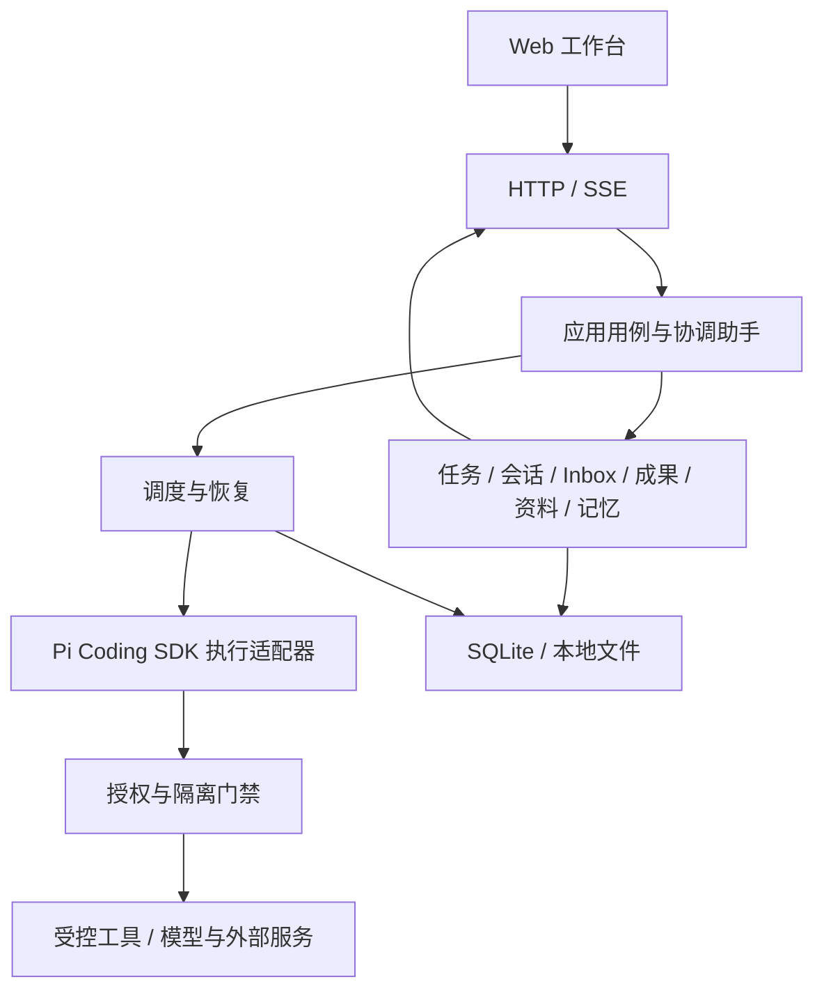

# Multivac MVP 实现架构

状态：已确认用于项目初始化 · 更新：2026-09-13

依据 [MVP 需求](../.my-docs/mvp.html)、[原型需求](../.my-docs/mvp-prototypes.md)和[最新 UI 原型](../prototypes/app.jsx)，从零设计。Demo 仅作功能验证，不要求兼容其代码、接口、目录或数据。本文只记录架构、模块边界、运行可靠性和安全不变量；功能范围与交互决策以需求文档为准。本文作为当前项目骨架的实现基线，后续架构调整需同步更新本文。

## 1. 架构目标与技术栈

面向个人的本地桌面 Web 工作台：协调助手组织工作，Coding Agent 执行任务，用户通过工作会话、Inbox 和成果入口参与判断。首版支持 macOS 和 Windows，支持多任务并行、持久化恢复、资料范围控制与长期记忆；不包含移动端、多租户、云端常驻或完整 IDE。

MVP 已确认基础技术方向；具体版本和依赖通过项目锁文件统一管理。

| 层次 | 技术与边界 |
| --- | --- |
| 前端 | React + TypeScript/TSX + Vite；CSS 设计变量、Lucide 图标；服务端数据缓存与导航/草稿状态分离 |
| 服务端 | Node.js + TypeScript ESM；本地 HTTP 服务，业务逻辑不依赖 HTTP 对象 |
| 通信 | 同源 HTTP JSON 命令/查询 + SSE 状态与流式事件 |
| 契约 | 建议 TypeBox 统一 DTO schema 与静态类型；服务端执行运行时校验 |
| Agent | 直接使用 Pi Coding SDK；通过执行适配器接入，不向领域层暴露 SDK 内部类型 |
| 存储 | SQLite 保存业务事实，本地文件保存附件、成果和大输出；驱动版本通过项目锁文件管理 |
| 记忆 | 通过 MCP 接入记忆服务，不为 Mem0 提供专门适配；Mem0 作为 MCP 服务接入；模型和 embedding 的部署位置由 embedding 端配置；不为资料库引入向量检索系统 |
| 工程 | npm workspaces、单一 lockfile、严格 TypeScript；tsc/tsx；node:test 与 Playwright |

## 2. 总体架构

采用**模块化单体**：一个本地服务拥有业务状态、授权与调度权；工具命令运行于受控子进程。单仓库分包用于隔离前后端依赖，不代表拆分部署服务。子进程本身不等于安全沙箱。



- **协调助手**理解意图、提出结构化命令；创建任务和修改状态必须经过应用用例校验，普通讨论不强制任务化。
- **领域模块**拥有业务规则和数据；任务完成、授权、验收等事实不由模型文本或前端自行推断。
- **调度器**是确定性程序，负责队列、资源分配、暂停、恢复与预算，不把调度权交给 Agent 自主循环。
- **执行器**按任务范围和租约调用工具，通过受控入口访问模型、文件和外部服务。
- **SQLite**是业务事实源；运行中的 Agent、SSE 和页面缓存均可从持久记录重建。

## 3. 目录与模块边界

采用常见 TypeScript monorepo 的 `apps/`、`packages/` 大结构。每个应用/包独立声明依赖、脚本和 tsconfig；不为目录形式额外引入 Turborepo 或 Nx。

```text
multivac/
  apps/
    web/
      src/
        app/                  # Shell、导航、启动与返回现场
        features/             # 按功能组织页面、组件和 hooks
        components/           # 通用 UI 基础组件
        data/                 # API client、SSE 与数据缓存
        styles/               # 设计变量和基础样式
        main.tsx
      public/
      tests/
      index.html
      package.json
      tsconfig.json
      vite.config.ts
    server/
      src/
        bootstrap/            # 服务装配、启动与关闭
        application/          # 跨模块用例、事务与命令幂等
        modules/              # 领域规则和持久化端口
        runtime/              # 调度、执行、恢复与隔离
        adapters/             # HTTP、模型、记忆和解析器适配
        storage/              # 数据路径、数据库和迁移机制
        main.ts
      tests/
      package.json
      tsconfig.json
  packages/
    contracts/                # 前后端共享 DTO、schema、事件与错误码
      src/
      tests/
      package.json
      tsconfig.json
  tests/e2e/                  # 跨应用产品链路
  docs/                       # 需求、架构与验证记录
  scripts/                    # 构建、打包和验证脚本
  .github/workflows/
  package.json
  package-lock.json
  tsconfig.base.json
  playwright.config.ts
  README.md
```

### 服务端模块

| 位置 | 职责 |
| --- | --- |
| `modules/tasks` | 任务目标、分组、依赖、优先级与状态 |
| `modules/sessions` | 消息、上下文、栈式分支与追加指令 |
| `modules/workspaces` | 会话集合、有序关联与多工作区归属 |
| `modules/inbox` | 澄清、验收、授权请求及决策记录 |
| `modules/artifacts` | 成果版本、来源、验证证据与验收 |
| `modules/documents` | 资料元数据、附件、解析状态与范围绑定；首批仅解析 Markdown 和 HTML |
| `modules/memory` | 长期信息筛选、范围、来源、纠错与删除；通过 MCP 接入记忆服务，模型和 embedding 的部署位置由 embedding 端配置 |
| `modules/permissions` | 授权、撤销和副作用操作账本 |
| `runtime` | scheduler、recovery、executors、tools、isolation、repositories |

### 依赖约束

- Web 与服务只共享 `@multivac/contracts` 的公开导出；禁止跨应用相对路径引用。契约包不能依赖 Node、数据库或 Pi。
- 各领域模块拥有自己的表和迁移，通过公开服务协作；跨模块事务由 application 编排，不越过边界直接改表。
- 具体厂商、解析器与隔离实现由适配器封装并注入；领域规则不放在 HTTP 路由、UI 组件或 SDK 回调中。
- 单服务内部模块不拆成独立 npm 包。只有实际跨应用共享的代码才进入 `packages/`，不预建万能 shared/utils 包。
- 各应用构建到自己的 `dist/`，发布时装配成一个本地发行物。数据库、用户资料、任务 worktree 与源码目录分离。

## 4. 核心数据模型

| 对象 | 关系与不变量 |
| --- | --- |
| Project / TaskGroup | 项目是资源范围边界，分组仅用于组织，不隐式授予权限 |
| Task / Run | Task 表示长期目标，Run 表示一次执行尝试；检查点、预算与租约属于执行记录 |
| Session / Message | 会话独立于任务和工作区；同一会话同时最多一个 Run 写入 |
| Workspace / SessionBranch | 工作区与会话多对多；栈式子会话保留来源和背景快照，返回父级不自动回写 |
| HumanRequest / Decision | 请求关联任务与会话；已查看、已回应和请求失效分开；决策绑定请求版本 |
| Artifact / ArtifactVersion | 成果有固定版本、来源 Run 和验证证据；验收绑定版本，修改产生新版本 |
| Grant / Operation | 授权与实际副作用分开，绑定材料版本、用途、通道和目标 |
| Document / Memory | 文档保留原件/副本、解析状态与范围；记忆保留来源和修订，不作为权限或执行事实源 |

任务调度状态、执行尝试状态、成果验收状态和外部发送/发布状态分别建模。拒绝外部发送/发布不改变成果完成事实；要求修改不覆盖旧版本验收记录。持久实体使用稳定 ID，更新通过 revision 检查并发冲突。

## 5. 运行与可靠性约束

### 调度与恢复

- 工作任务并行度不设产品层面的上限；实际启动受可用资源、任务依赖、执行租约和总预算约束。协调助手使用独立预算，显示列数和浏览器连接数不限制任务并行度。
- 让位或降低并发时，先安全停止并保存检查点，再释放执行资源；无法确认停止则继续排队，不启动可能冲突的新执行。
- 用户暂停不能自动解除；调度暂停可在条件满足时恢复。等待人工不占用执行资源，保留检查点和人工请求。
- 工作台关闭不影响已启动任务；任务继续运行至成功、失败或明确取消等终态，并持久化执行结果。系统休眠、进程终止和重开时，依据持久化执行记录恢复任务状态和结果。
- Loop 受任务范围、依赖和总预算约束。运行次数、时间、重试与输出大小有上限，拆分子任务不能绕过预算。
- 重启先核对执行租约、检查点和操作结果，再恢复具备条件的任务；结果不明的副作用转人工核对，不盲目重放。
- 单服务实例拥有调度和写入权；旧执行租约失效后禁止继续写入。无法证明旧执行已停止时，不启动冲突的新执行。

### 持久化与通信

- 业务状态、命令回执和事件在同一数据库事务提交；命令携带幂等 ID 和目标 revision，重复请求不重复产生业务变更。
- SQLite 保存元数据与消息；大输出和附件存本地文件，以受控文件键和哈希引用。文件写入与数据库事务不具有共同回滚保证，需要处理孤儿文件。
- 事务保持短小，不包含模型、网络或文件解析；迁移从 MVP 首版开始管理，发布后不修改已应用迁移。
- Web 先读取带游标的快照，再订阅 SSE；断线可重放，游标失效则重新同步。事件可重复消费，流式输出节流，慢客户端不能拖垮执行。
- 对外操作记录执行意图和结果；执行中崩溃可能产生 unknown 状态。仅在目标支持可靠幂等或可查证结果时自动对账，不承诺通用 exactly-once。

## 6. 安全与 UI 状态边界

### 授权与隔离

- 服务默认仅本机访问，执行 Host/Origin 校验、CSP 与请求限制；浏览器不持有密钥、不直接运行工具。
- 本地读取、模型传输、记忆处理与外部发送/发布分别授权，在实际副作用前重新检查范围与撤销状态。资料、Skills、项目指令不能自行授予权限。
- Coding 任务支持 Git 和非 Git 目录。Git 仓库采用独占 worktree、分支和固定 baseline；非 Git 目录使用独占工作目录和文件范围约束，不依赖 worktree 或分支。任务成果统一串行整合到独立候选区，不覆盖用户 dirty 工作树。
- worktree 不代替 OS 沙箱。工具读写、网络和子进程须由验证过的机制约束；能力不可验证时默认拒绝，用户授权不能绕过隔离失败。
- 验收与发布分开，发送/发布逐次确认；磁盘删除明确确认。移出资料库不删除原件，附件入库不自动扩大使用范围。
- 密钥不下发给工具子进程，日志和事件需防泄漏；压缩、分支继承、记忆提取不得丢失材料来源与范围信息。

### 工作现场与 Inbox

- 导航、焦点、栈路径、滚动位置、列宽和草稿与业务状态分离；后台事件只更新数据，不自动切换页面或抢焦点。
- Inbox 抽屉与完整页面使用同一请求、草稿和决策状态。抽屉保持背景布局、限制背景交互；关闭或来源跳转后可恢复现场。
- Inbox 汇总是人工请求的统一提醒入口，不创建重复请求；范围澄清不默认同意，成功显示原位回执。
- Inbox 只通过未读请求数量提示待处理事项；数量变化时播放简单动画，不使用其他提醒层级或系统通知。
- 成果、任务和操作结果必须来自服务端事实，不沿用原型的模拟成功。记忆编辑/删除需确认底层处理结果，不能只从 UI 隐藏。
